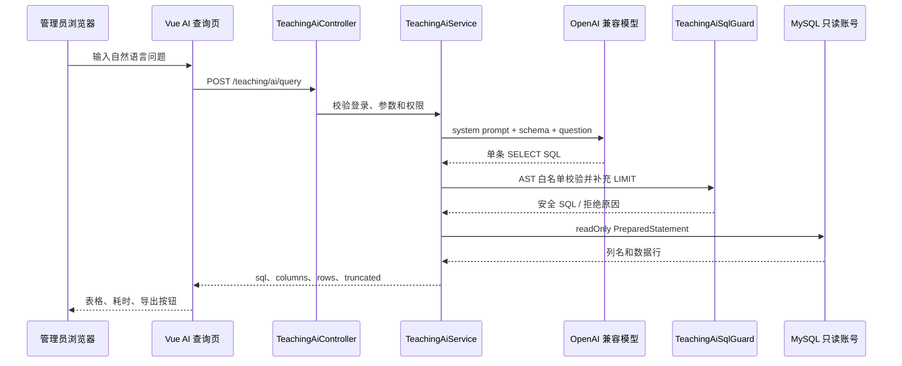

# AI 自然语言查询功能实现文档

## 1. 文档范围

本文档把 `docs/demand/基于AI大模型的实验教学项目管理系统.docx` 中的“自然语言查询模块”落地到当前项目：Spring Boot 2.2 + MyBatis-Plus + MySQL 8 + Vue 2 + Element UI。

目标是让管理员用中文或英文描述数据需求，系统完成“问题理解 → SQL 生成 → 安全校验 → 只读执行 → 表格展示/导出”。AI 只负责生成查询语句，业务数据库和权限仍由后端控制。

当前代码已有以下基础实现，可作为本方案的第一版落点：

- `TeachingAiController`：提供 `/teaching/ai/status` 和 `/teaching/ai/query`。
- `TeachingAiService`：调用 OpenAI 兼容的 Chat Completions 接口，读取业务元数据，执行只读查询并限制结果规模。
- `TeachingAiSqlGuard`：使用 JSqlParser 对 SQL AST 做白名单校验。
- `TeachingAiTest`、`TeachingAiSqlGuardTest`、`TeachingAiDatabaseTest`：覆盖配置状态、SQL 防护和真实只读账号验证。

## 2. 需求与验收标准

### 2.1 功能需求

1. 管理员可以在输入框填写自然语言问题，并查看提示词示例。
2. 系统支持学年、学期、课程、课表、实验室、实验项目和实验人数等查询。
3. AI 生成的 SQL 在后端校验后执行，结果以表格展示，并支持 Excel 导出。
4. 无法理解的问题、无数据结果、模型异常和查询超时都返回可理解的提示。
5. 教师只能使用现有的业务统计接口查看本人教学范围；自然语言跨表查询默认仅管理员可用。

### 2.2 非功能验收

- 只允许访问业务白名单表和字段，拒绝写操作、DDL、多语句、注释、子查询、UNION、CTE、文件读写及锁语句。
- AI 数据库账号不是 `root`，仅拥有白名单业务表的 `SELECT` 权限。
- 单次请求最多返回 200 行，SQL 执行超时 5 秒，连接超时 5 秒，读取超时 7 秒。
- 用户问题最长 1000 字符，模型输出 SQL 最长 12000 字符。
- API Key、数据库密码不进入代码、日志和 Git。
- 关键路径具有自动化测试，且能在未配置模型时正常启动普通教学功能。

## 3. 总体架构



组件职责：

| 组件 | 职责 |
| --- | --- |
| Vue 页面 | 示例问题、提交状态、结果表格、错误提示、Excel 导出 |
| Controller | 登录态读取、请求体接收、统一 `R` 响应 |
| Service | 编排模型调用、元数据拼装、数据库执行、异常转换 |
| Schema 提供器 | 只输出允许的表、字段、类型和业务关联 |
| SQL Guard | 解析 SQL AST，执行表/函数/表达式/行数白名单 |
| AI 只读连接 | 独立账号、只读连接、超时和最大结果限制 |

## 4. 数据范围与 Schema 知识

### 4.1 首期允许访问的业务表

`TeachingAiSqlGuard.TABLES` 维护最终白名单：

`academic_year`、`academic_term`、`course`、`teaching_task`、`schedule_detail`、`experiment_project`、`teaching_task_teacher`、`shiyanshixinxi`。

账号表、密码字段、令牌表、系统表和采购等无关表不进入提示词，也不允许出现在 SQL 中。Schema 查询使用 `information_schema.COLUMNS`，只读取列名、类型和必要的注释。

### 4.2 业务关联规则

元数据中明确写出以下关联，避免模型自行猜测：

```text
teaching_task.term_id = academic_term.id
academic_term.academic_year_id = academic_year.id
teaching_task.course_id = course.id
schedule_detail.task_id = teaching_task.id
schedule_detail.lab_id = shiyanshixinxi.id
experiment_project.task_id = teaching_task.id
teaching_task_teacher.task_id = teaching_task.id
```

统计人时必须从 `schedule_detail` 计算：`hours * teaching_task.enrollment_count`。实验室地点应通过课程课表关联得到，不能把实验项目重复计入人时。

### 4.3 Schema 缓存策略

当前版本每次查询动态读取 Schema，优点是结构变化立即生效。生产环境可增加 5 分钟缓存，缓存键为 `teaching:ai:schema:v{version}`；数据库迁移或管理员手动刷新时递增版本。缓存内容不得包含账号密码、个人敏感信息和实际业务数据。

## 5. API 设计

### 5.1 查询能力状态

`GET /teaching/ai/status`

响应示例：

```json
{
  "code": 0,
  "data": {
    "configured": true,
    "available": true,
    "admin_only": true,
    "model": "your-model",
    "examples": ["按学期统计教学任务数量", "列出实验学时最多的10门课程"]
  }
}
```

未配置模型时 `configured=false`，页面仍可打开并显示配置提示；教师登录时 `available=false` 并说明该功能仅供管理员使用。

### 5.2 执行自然语言查询

`POST /teaching/ai/query`

请求体只接受 `question`，拒绝客户端传入 `sql`：

```json
{ "question": "显示2024-2025学年第1学期36栋401实验室开设的实验课程" }
```

成功响应：

```json
{
  "code": 0,
  "data": {
    "sql": "SELECT ... LIMIT 201",
    "columns": ["course_name", "teacher_name"],
    "rows": [{"course_name": "程序设计实验", "teacher_name": "张老师"}],
    "truncated": false
  }
}
```

`rows` 达到 200 行时返回 `truncated=true`，前端提示“结果已截断，请缩小查询范围”。SQL 可在管理员调试场景展示；普通用户页面只展示自然语言结果，避免泄露内部表结构。

### 5.3 错误响应

统一使用现有 `R.error(message)`。建议映射：

| 情况 | HTTP | 用户提示 |
| --- | --- | --- |
| 未登录/非管理员 | 401/403 | 请使用管理员账号登录 |
| 参数缺失或超长 | 400 | 请用不超过 1000 字的自然语言描述问题 |
| 未配置模型 | 503 | AI 尚未配置，请联系管理员 |
| 模型超时/网络失败 | 502 | AI 服务暂时不可用，请稍后重试 |
| SQL 被拦截 | 422 | 问题生成的查询不符合安全规则，请换一种问法 |
| 查询超时/字段错误 | 422 | 查询未完成，请缩小范围或明确学期、课程、实验室 |

## 6. Prompt 与模型调用

### 6.1 System Prompt 要点

后端固定 system prompt，用户问题只能作为单独的 user message 传入。Prompt 至少包含：

1. 角色：实验教学统计助手。
2. 输出格式：只输出一条 MySQL `SELECT`，不输出 Markdown、解释或多条语句。
3. 表和字段：仅使用注入的白名单 Schema。
4. 禁止项：写操作、DDL、注释、变量、文件函数、CTE、UNION、子查询、窗口函数、锁。
5. 业务规则：人时公式、课表地点、学期关联和教师范围规则。
6. 无法回答时生成固定兜底查询，例如 `SELECT '当前数据无法回答此问题' AS message FROM academic_year LIMIT 1`。
7. 强制结果上限 200 行，优先按用户条件过滤。

模型参数建议：`temperature=0`、`max_tokens=1500`。调用地址兼容 OpenAI Chat Completions：环境变量可配置 `/v1` 或完整 `/chat/completions` 地址，服务端统一补全路径。

### 6.2 不信任模型输出

模型输出即使符合 Prompt，也必须经过 `TeachingAiSqlGuard.validate`。不得采用字符串查找 `startsWith("SELECT")` 作为唯一防护。Guard 解析 AST 并检查：

- 根节点必须是 `PlainSelect`；拒绝 UNION、CTE、子查询和多语句。
- 表名必须属于白名单，JOIN 必须带 `ON` 且最多 6 张表。
- 函数仅允许统计、字符串和日期白名单函数。
- 拒绝 INTO、OUTFILE、锁、注释、变量、睡眠函数等高风险语法。
- LIMIT 只能是非负整数，强制收敛到最多 201（读取 201 行以识别是否超过 200 行）。

## 7. 数据库安全

### 7.1 创建最小权限账号

在独立管理连接中执行，密码通过安全渠道注入：

```sql
CREATE USER 'teaching_ai_reader'@'%' IDENTIFIED BY '替换为随机强密码';
GRANT SELECT ON t132.academic_year TO 'teaching_ai_reader'@'%';
GRANT SELECT ON t132.academic_term TO 'teaching_ai_reader'@'%';
GRANT SELECT ON t132.course TO 'teaching_ai_reader'@'%';
GRANT SELECT ON t132.teaching_task TO 'teaching_ai_reader'@'%';
GRANT SELECT ON t132.schedule_detail TO 'teaching_ai_reader'@'%';
GRANT SELECT ON t132.experiment_project TO 'teaching_ai_reader'@'%';
GRANT SELECT ON t132.teaching_task_teacher TO 'teaching_ai_reader'@'%';
GRANT SELECT ON t132.shiyanshixinxi TO 'teaching_ai_reader'@'%';
FLUSH PRIVILEGES;
```

实际部署前根据数据库所在主机收紧 `'%'`，并用 `SHOW GRANTS` 验证不存在 `INSERT`、`UPDATE`、`DELETE`、`DROP`、`ALTER` 等权限。

### 7.2 连接与执行限制

使用独立 JDBC 连接：`readOnly=true`、`autoCommit=false`、`allowMultiQueries=false`；PreparedStatement 设置连接/Socket/查询超时、最大行数 201、最大字段长度 4000。异常日志只记录 requestId、耗时、模型名和错误类别，不记录 API Key、数据库密码、完整用户问题或敏感结果。

## 8. 前端页面实现

在现有路由 `/teaching/ai` 下实现 Vue 2 页面，复用 Element UI：

1. 页面加载调用 `/teaching/ai/status`，根据 `available` 显示输入框或配置说明。
2. 使用 `el-input type="textarea"`，限制 1000 字；下方展示 3~5 个可点击示例。
3. 提交期间禁用按钮并显示 loading；禁止前端传 `sql` 字段。
4. 结果用 `el-table` 动态渲染 `columns`，空结果显示“没有匹配数据”。
5. 导出沿用项目已有 `vue-json-excel`，导出前端当前 `rows`，文件名包含日期和查询摘要。
6. 不使用 `v-html` 渲染模型文本；错误信息使用 Element UI Message。
7. 小屏幕下表格启用横向滚动，保留“重新提问”和“清空结果”操作。

前端只保存结果，不保存 API Key。若展示 SQL，应加“仅供管理员调试”标识，并默认折叠。

## 9. 配置与部署

后端启动进程配置：

```text
TEACHING_AI_BASE_URL=https://api.example.com/v1
TEACHING_AI_API_KEY=从密钥管理系统注入
TEACHING_AI_MODEL=模型名称
TEACHING_AI_DB_USER=teaching_ai_reader
TEACHING_AI_DB_PASSWORD=只读账号密码
TEACHING_AI_DB_URL=可选，独立只读 JDBC URL
```

启动前检查：

1. `TEACHING_AI_DB_USER` 不得为 `root`。
2. `/teaching/ai/status` 返回 `configured=true`。
3. 用测试问题验证只读账号可以查询白名单表，不能执行 `UPDATE`。
4. 生产环境限制模型服务出口地址，配置 HTTPS、连接超时和速率限制。
5. 密钥只放在环境变量或密钥管理系统，禁止写入 `application.yml`、SQL、日志和提交记录。

## 10. 测试方案

### 10.1 单元测试

- Guard 拒绝 `UPDATE/DELETE/INSERT/DDL`、多语句、注释、UNION、CTE、子查询、未知表、未知函数、无 `ON` 的 JOIN、超长 LIMIT。
- Guard 接受课程列表、实验室过滤、分组统计、日期过滤和允许的聚合函数。
- Service 在未配置、非管理员、空问题、模型响应缺字段时返回明确异常。
- 结果集重复列名自动生成唯一列名，超过 200 行标记 `truncated`。

### 10.2 集成与验收用例

| 用例 | 预期 |
| --- | --- |
| “显示某学期某实验室开设的实验课程” | 返回课程表格 |
| “统计某实验室各课程实验人时数” | 按 `hours * enrollment_count` 聚合 |
| “列出实验学时最多的10门课程” | 返回不超过 10 行 |
| 输入“删除所有课程” | 被拒绝，不访问数据库 |
| 输入含 SQL 注入和注释 | 被拒绝 |
| 模糊问题“查一下数据” | 返回引导用户补充学年/学期/范围 |
| 模型不可用 | 返回 502 友好提示，普通教学功能不受影响 |

执行命令：

```powershell
cd back
mvn test
cd ..\front
npm run lint
npm run build
```

配置真实测试库时再执行 `TeachingAiDatabaseTest`，测试账号必须是临时只读账号，测试数据使用事务或独立库隔离。

## 11. 迭代计划与后续增强

### 第 1 周：可用闭环

- 固化表/字段白名单、Prompt 和 SQL Guard。
- 完成管理员页面、状态接口、查询接口和基本导出。
- 通过单元测试和模型 Mock 测试。

### 第 2 周：准确性与体验

- 建立 20~30 条真实业务问题基准集，记录 SQL 正确率、执行成功率和响应时间。
- 增加 Schema 缓存、问题改写提示和结果摘要。
- 对查询结果增加图表建议，但图表数据仍必须来自已校验的结果集。

### 后续版本

- 将 Schema 和业务术语维护为版本化元数据表，支持管理员刷新。
- 增加审计表记录 requestId、用户、SQL 哈希、耗时、行数和结果状态，不保存敏感原文。
- 若开放教师查询，必须在 SQL 执行前注入当前教师范围条件，并为教师单独设计白名单视图；不能只依赖前端隐藏入口。
- 对模型服务增加重试退避、熔断和调用配额，避免模型故障拖垮教学系统。

## 12. 风险与处理原则

- 模型生成 SQL 可能语义错误：以 Guard、执行错误提示和基准集评估降低风险，页面明确“结果仅供辅助分析”。
- Schema 变化可能导致旧 Prompt 失效：迁移后刷新 Schema 版本并回归基准问题。
- 查询结果可能包含个人信息：白名单排除账号密码等敏感字段，必要时改为脱敏视图。
- 外部模型存在数据出境风险：上线前确认服务商合规要求；不得把密码、令牌和无关个人信息发送给模型。

