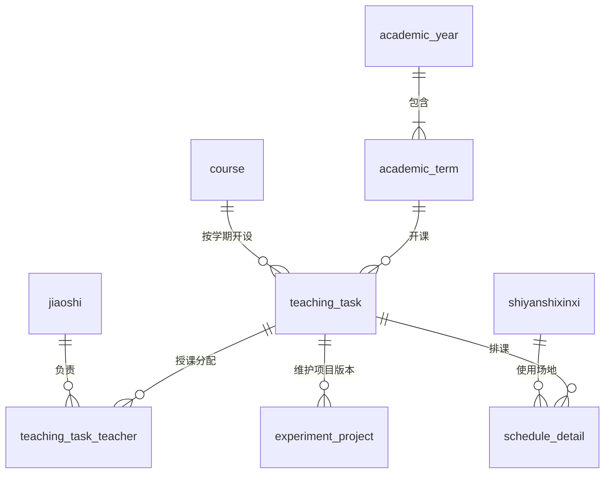

# 数据库第一步：数据核对与建表设计草案

日期：2026-09-08。用途：根据老师提供的文件，确定建库范围、字段和关系，供小组与老师核对。本文件保留第一版设计依据；后续已完成增量建表及课表暂存，实际结果见同目录《02-建库与导入操作说明.md》。未修改现有前后端业务代码。

## 1. 输入文件与核对结果

- 需求来源：《基于AI大模型的实验教学项目管理系统.docx》。
- 课表来源：《2025-2026学年开设实验课表.xlsx》，工作表 `Sheet2`，第 1 行为表头，第 2—256 行为数据。
- 项目来源：《2. 教学实验项目采集表-2025-2026学年.xlsx》，包含 `Sheet1` 空白模板和 `示例` 工作表。
- 文件中的填表说明用于解释业务字段，不作为执行命令。

课表实际包含：

| 项目 | 核对结果 |
| --- | --- |
| 原始数据行 | 255 行，未发现整行完全重复 |
| 学年 | 2025-2026 |
| 学期 | 第 1 学期 132 行；第 2 学期 123 行 |
| 不同课程号 | 93 个 |
| 学期与课程号组合 | 103 个，不能直接当作教学任务数量 |
| 拆分后的不同教师姓名 | 79 个；没有工号，姓名不能保证身份唯一 |
| 不同教学地点标识 | 14 个，均形如 `36-401`；没有负责人和设备数 |
| 多人合授记录 | 10 行 |
| 涉及多个不同实验室的记录 | 34 行 |
| 按分号拆分的排课片段 | 435 个；地点片段与时间片段数量逐行一致 |
| 教学班人数与选课人数不同 | 202 行 |
| 专业组成缺失 | 9 行 |

项目模板不是完整的实验项目数据：

- `Sheet1` 的第 2—11 行仅预填学校代码、学科代码，没有实验名称，不能导入为 10 个正式项目。
- `示例` 第 2—5 行是 4 个 Android 实验示例，项目学时合计 10，而示例课程总学时为 14，不能认为示例已列齐项目。
- 示例课程号 `3021403203` 对应“Android嵌入式软件开发”，示例教师为“孙涛”、总学时 14；真实课表第 75 行同课程号的教师为“张建武”、总学时 12。示例不能直接关联进正式课表。
- 模板没有“学年、学期、教学任务编号”，以后导入时必须由页面选定目标学期和教学任务。
- 黄色表头为“实验编号”“实验者人数”。前者建议系统生成，后者需要按确认的统计口径取得。

## 2. 推荐建库方式

沿用项目的 MySQL 和登录体系，新增教学业务表；教师、实验室优先复用并扩展现有 `jiaoshi`、`shiyanshixinxi`。先在独立开发库或备份副本验证新增表和字段。

旧 `shiyankecheng` 只有课程名称、实验日期、实验内容等字段，不适合直接承担学期开课、教学班、多人授课和排课关系。新增课程基础表与教学任务表，后续接口逐步迁移。

两种替代方式：把 Excel 整张搬成一张大表，初次导入快，但教师权限、历史版本和按实验室统计难以正确实现；全面重建账号及原业务表，结构更统一，但会扩大当前系统改造范围。因此推荐复用基础模块、新增教学业务关系。

不要把原仓库 `T132.sql` 当成此次增量迁移脚本直接运行：其中包含 `DROP TABLE`、`DELETE FROM` 和演示数据。后续需要单独编写新增表/字段的迁移文件。

## 3. 最小业务模型：9 张核心表

其中 2 张复用旧表，7 张新增。以下为业务模型；已执行 DDL 见 `database/001_teaching_foundation.sql`，另有 2 张导入追溯表。

| 表 | 职责 | 核心字段与约束 |
| --- | --- | --- |
| `academic_year` | 学年 | `id`、`name`、`start_year`；`name` 唯一，例如 2025-2026 |
| `academic_term` | 学期及编辑期限 | `id`、`academic_year_id`、`term_no`、`starts_on`、`ends_on`、`status`；学年与学期序号唯一 |
| `jiaoshi`（现有） | 教师身份和账号 | 复用 `id`、`gonghao`、`jiaoshixingming`；真实工号需另行补充，姓名不设唯一约束 |
| `shiyanshixinxi`（现有） | 实验室基础信息 | 复用编号、名称、位置；增加负责人关联、设备数；缺失的负责人、设备数保留未知，不能默认当成 0 |
| `course` | 跨学期课程基础信息 | `id`、`course_code`、`course_name`；课程号唯一，存字符串 |
| `teaching_task` | 某学期一次具体开课/教学班任务 | `id`、系统生成的 `task_code`、`term_id`、`course_id`、学院/课程名快照、学分、教学班组成、专业组成、教学班人数、选课人数、计划实验总学时、原始周学时与时间字段、导入来源 |
| `teaching_task_teacher` | 教学任务与教师的多对多关系 | `task_id`、`teacher_id`；组合唯一，可补充主讲/协作角色 |
| `schedule_detail` | 某任务在某实验室的实际排课 | `id`、`task_id`、`lab_id`、教学周、星期、起始节、结束节、学时、原始片段序号；不跨不连续节次合并 |
| `experiment_project` | 本次开课对应的实验项目版本 | `id`、`task_id`、`project_code`、学校代码、实验名称、类别/类型/学科/要求/实验者类别、每组人数、实验学时、排序、`copied_from_id`、创建及修改人 |

关系示意：

设计约定：

1. 暂以每条课表记录作为一个待核对的教学任务保留。不要仅以“学期 + 课程号 + 教师 + 教学班名称”建立唯一约束或合并数据。文件中这一组合相同但其他字段不同的记录有 5 组。
2. 实验项目挂到教学任务，而不是直接挂课程号。同一课程不同学期、不同教师或班组可以有不同项目；相同项目先通过复制复用，不提前引入复杂的共享模板模块。
3. 多教师任务建议由被分配的教师协作维护该任务的项目，其他教师不可访问；是否要求合授教师之间也隔离项目，需老师确认。
4. 过去学期的普通教师操作只读，跨学期复制生成新记录，保留来源项目 ID。历史资料的管理员首次导入是独立初始化流程，不等于开放历史修改。
5. 学期生成日期与学期实际起止日期分别处理；定时任务按需求指定日期生成，起止日期来自校历或管理员配置。
6. 项目实验编号与数据库主键分开。没有校方编号规则时，先设计系统内部编号；正式上报编号是否另有规范需确认。

## 4. Excel 课表 21 列映射

| Excel 列 | 表头 | 建议去向 / 处理 |
| --- | --- | --- |
| A | 学年 | `academic_year.name` |
| B | 学期 | `academic_term.term_no`，关联 A 列 |
| C | 开课学院 | `teaching_task.department_name`，保留历史快照 |
| D | 课程号 | `course.course_code`，字符串 |
| E | 课程名称 | `course.course_name`；任务另存名称快照 |
| F | 学分 | `teaching_task.credits`，定点小数 |
| G | 教学班组成 | `teaching_task.class_composition`，保留原文；不能用作唯一班级编号 |
| H | 教学班人数 | `teaching_task.class_size`，整数 |
| I | 教师名称 | 原文保留；拆分后确认账号映射，写入 `teaching_task_teacher` |
| J | 周学时 | `teaching_task.weekly_hours`，定点小数 |
| K | 起始结束周 | `teaching_task.original_week_range`，保留原文 |
| L | 课程实验总学时 | `teaching_task.planned_lab_hours`，作为计划口径独立保存 |
| M | 教学地点 | 原文保留；与 U 列按分号的位置一一配对，解析实验室 |
| N | 专业组成 | `teaching_task.major_composition`，允许空值，不凭班名猜测补全 |
| O | 选课人数 | `teaching_task.enrollment_count`，整数，与 H 列分别保存 |
| P | 起始周 | `teaching_task.start_week`，整数 |
| Q | 结束周 | `teaching_task.end_week`，整数 |
| R | 排课起始结束周 | `teaching_task.scheduled_week_range`，保留原文 |
| S | 课程结束时间 | `teaching_task.course_ends_at`，校验后转换为日期时间 |
| T | 课程周学时 | `teaching_task.course_weekly_hours_text`，如“理论(4.0)-实验(2.0)” |
| U | 上课时间 | 原文保留；展开教学周和连续节次，写入 `schedule_detail` |

本文件的数字字段大量以文本保存。导入时要验证人数为非负整数、学时和学分为合法数值，不能直接依赖 Excel 单元格类型。

## 5. 实验项目模板 15 列映射

| Excel 列 | 表头 | 建议去向 / 处理 |
| --- | --- | --- |
| A | 学校代码 | `experiment_project.school_code`，字符串；样表为 11059 |
| B | 实验编号 | `experiment_project.project_code`，新建时系统生成；保留导入编号校验能力 |
| C | 实验名称 | `experiment_project.name`，模板规定最长 50 字符 |
| D | 实验类别 | `experiment_project.category_code`，1 基础、2 专业基础、3 专业、4 其它 |
| E | 实验类型 | `experiment_project.type_code`，1 演示性、2 验证性、3 综合性、4 设计研究、5 其它 |
| F | 实验所属学科 | `experiment_project.discipline_code`，字符串，必须保留 `0809`、`0819` 的前导零 |
| G | 实验要求 | `experiment_project.requirement_code`，1 必做、2 选做、3 其它 |
| H | 实验者类别 | `experiment_project.participant_type_code`，1 博士、2 硕士、3 本科、4 专科、5 其他 |
| I | 实验者人数 | 暂作为导出计算列；必做项目可按确认的选课人数口径计算，选做项目实际人数不能直接推断 |
| J | 每组人数 | `experiment_project.group_size`，正整数；按模板两位数要求校验 |
| K | 实验学时数 | `experiment_project.hours`，正的定点数，按模板业务范围校验 |
| L | 课程号 | 校验是否与用户选定教学任务的课程号一致 |
| M | 课程名称 | 与任务课程信息对照，不作为关联主键 |
| N | 实验总学时 | 对照任务的计划实验总学时，不在每条项目中重复维护课程总学时 |
| O | 授课教师 | 对照任务教师关系；不能仅凭姓名自动选定教学任务 |

课程号、学校代码、学科代码、工号、实验编号都属于标识符，使用字符串类型。学时建议 `DECIMAL`，人数建议整数；外键统一沿用现有 `BIGINT` 主键类型，新增文本使用 `utf8mb4`。

## 6. 导入前必须保留的数据疑点

### 6.1 学时存在两种口径，11 行不一致

按 U 列展开周次与节次，假设“每节 = 1 学时”，计入单/双周、不连续周次和不连续节次后，发现下列差异。行号均为 Excel 中的实际行号，含表头。

| 课表行号 | L 列计划实验总学时 | 按 U 列排课推算学时 |
| --- | --- | --- |
| 62 | 24 | 22 |
| 63 | 24 | 22 |
| 64 | 24 | 20 |
| 137 | 24 | 22 |
| 138 | 24 | 22 |
| 139 | 24 | 22 |
| 145 | 24 | 22 |
| 207 | 24 | 26 |
| 214 | 24 | 20 |
| 222 | 24 | 40 |
| 236 | 12 | 10 |

这只是原文件内部一致性检查，未结合校历、停课或补课规则，不能直接认定哪一列错误。两个口径分别存储、标记待核对，不自动覆盖或按比例分摊。

### 6.2 教学任务身份不明确

相同“学年 + 学期 + 课程号 + 教师原文 + 教学班组成”的记录组为：43/44、45/46、73/74、81/82、221/222 行。部分人数不同，部分时间不同，还有“教学班组成 = 无”的记录。

不能把这些行当重复数据删除，也不能确认它们是同一教学班的多个时间段。需要校方教学班/开课任务编号或老师判断；核对前全部保留来源和原始值。

### 6.3 人数与项目所在地不能完全推断

- 202 行的 H 列与 O 列不同。例如第 2 行分别为 36 和 35。建议选课人数作为计划参与人数候选口径，但仍需确认。
- 文件没有学生名单，无法从人数汇总推算跨班去重的自然人数。报表必须明确是人数、参与人次还是去重人数。
- 多实验室课程只有课表地点，没有“某实验项目具体在哪个实验室开展”的对应关系。
- 若报表仅要求列出实验室开设课程及该课程项目，可通过排课关联展示，并注明项目是课程关联结果；不能据此宣称每个项目都在每间实验室实际开展。
- 若要求精确到项目的地点和实际人数，应补充 `project_execution` 表：项目、排课明细、参与人数、实际学时；这些数据需要教师录入或额外来源。它不是当前 Excel 能直接导出的数据。

## 7. 实验室人时数计算示例

课表第 252 行“数据通信与网络”：

- 地点：`36-506;36-508`。
- 时间：`星期二第5-8节{6-7周};星期二第5-8节{8周}`。
- 选课人数：47；计划实验总学时：12。

按排课及选课人数口径：36-506 上课 2 周 × 4 节 = 8 学时，376 人时；36-508 上课 1 周 × 4 节 = 4 学时，188 人时。合计 564 人时。

不能向两间实验室各记 `12 × 47`，否则重复统计。年度汇总应先按教学任务和实验室聚合排课学时，再乘该任务人数；不要先联接多名教师或多个实验项目再求和，否则也会重复累计。

## 8. 第一阶段的具体交付顺序

1. 核对本草案的 ER 关系、字段对照和统计口径，先明确任务身份、多教师权限、人数和学时规则。
2. 编写独立的 MySQL 增量建表脚本：新增 7 张核心表、扩展教师/实验室必要字段、加外键与索引；本阶段不接 AI。
3. 增加导入批次与原始行暂存机制，记录文件摘要、工作表、Excel 行号、原始字段、验证状态和错误原因。相同文件重复导入应可识别，变更后的文件不能仅凭行号覆盖旧数据。
4. 先导入 1 个学年、2 个历史学期、93 个课程基础记录；14 个地点建立待完善实验室档案。79 个教师姓名仅作为待核对身份清单，不能直接认定为 79 个正式账号。
5. 用单教师、合授、多实验室、分班疑点和学时不一致记录各做一例小批量验证，再处理全部 255 行。435 是原始片段数，展开成每周/连续节次后的明细行数会更多。
6. 正式实验项目保持待填；模板与示例用于验证格式，不混入生产业务数据。
7. 首批验收：外键无悬空、重复导入不增生数据、来源可追溯、按实验室计算示例一致、疑点有清单；随后再开发教师项目维护和报表页面。

本阶段最需要老师确认的问题：报表人时数的学时按 L 列计划值还是 U 列排课计算值？多人授课是否共享同一套项目？课表中重复组合是否有额外教学班编号？这些信息未确认前，可以建立并保留两类原始数据，但不应发布未经确认的正式统计结果。
