# T132 数据库结构设计图

依据当前 `T132.sql`：11 张表、84 个字段、14 条外键。图示不是旧后端结构。

## 读图说明

- 课程保存课程资料；教学任务表示某学期的一次独立开课。
- 课程与教学任务是一对多，同课程、同学期允许不同任务。
- 教师账号与教学任务通过任务教师关联表构成多对多，支持不同老师分别开课和多人合授。
- 教学任务分别与实验项目、排课明细构成一对多。实验项目没有直接指向实验室的外键。
- 导入原始行与教学任务是可选一对一；手工创建的任务可没有来源行。
- PK 表示主键，FK 表示外键；主键组合、唯一约束及 CHECK 约束以 SQL 为准。
- `||` 为恰好一个，`o|` 为零或一个，`o{` 为零个或多个；图中可存在尚未分配教师的任务，是否允许发布由业务层校验。

## 完整 ER 图

以下 Mermaid 源码包含全部表、字段和外键，可在支持 Mermaid 的编辑器中渲染。

```mermaid
erDiagram
    direction LR
    account["账号表 · account"] {
        bigint id PK "账号主键，管理员和教师统一编号"
        varchar username UK "唯一登录名，教师使用工号；TMP前缀表示待核实的临时工号"
        varchar password_hash "登录密码摘要，不保存明文密码"
        varchar display_name "显示姓名，教师账号填写教师姓名"
        varchar role "账号角色：ADMIN管理员，TEACHER教师"
        varchar college "所属学院，未知或不适用时为空"
        timestamp created_at "账号创建时间"
    }
    academic_term["学年学期表 · academic_term"] {
        bigint id PK "学期主键"
        smallint start_year "学年起始年份，如2025表示2025-2026学年"
        tinyint term_no "学期序号：1第一学期，2第二学期"
        date starts_on "本学期开始日期，按实际校历维护"
        date ends_on "本学期结束日期，按实际校历维护"
        varchar status "状态：DRAFT草稿，OPEN开放，ARCHIVED归档；应用层禁止修改历史教学数据"
    }
    course["课程表 · course"] {
        bigint id PK "课程主键"
        varchar course_code UK "课程号，按字符串保存；同名不同号的课程分别保存"
        varchar course_name "课程当前名称"
        timestamp created_at "课程创建时间"
    }
    laboratory["实验室表 · laboratory"] {
        bigint id PK "实验室主键"
        varchar lab_code UK "实验室唯一编号，如36-401"
        varchar lab_name "实验室名称"
        varchar location "实验室位置或地址"
        bigint manager_account_id FK "负责人账号ID，应用层限定为TEACHER角色；未知时为空"
        int equipment_count "设备数量，NULL表示未知，0表示已确认没有设备"
        varchar status "状态：ACTIVE可使用，INACTIVE停用"
        timestamp created_at "创建时间"
    }
    teaching_import_batch["课表导入批次表 · teaching_import_batch"] {
        bigint id PK "导入批次主键"
        char file_sha256 UK "文件内容SHA256摘要，防止同一文件重复导入"
        varchar file_name "原始文件名"
        varchar parser_version "解析器版本，便于核对历史解析结果"
        int row_count "源文件有效数据行数，不是已成功转为教学任务的数量"
        timestamp created_at "导入时间"
    }
    teaching_import_row["课表导入原始行表 · teaching_import_row"] {
        bigint id PK "原始导入行主键"
        bigint batch_id FK "所属导入批次ID"
        varchar sheet_name "来源工作表名称"
        int source_row "来源Excel实际行号，包含表头行"
        json raw_data "完整原始行，保留课程、教师、班级人数、计划周次及时间地点原文等全部源字段"
        json issues "解析问题和人工核对说明，无问题时保存空数组"
        varchar status "状态：REVIEW待核对，ERROR错误，PROMOTED已转正式任务"
    }
    teaching_task["教学任务表 · teaching_task"] {
        bigint id PK "教学任务主键，一条记录代表一次独立开课"
        varchar task_code UK "独立且唯一的教学任务编号，不能仅由课程号和学期确定"
        bigint term_id FK "所属学期ID"
        bigint course_id FK "所属课程ID，同课程在同学期允许多个任务"
        bigint source_import_row_id FK, UK "来源课表行ID，手工创建时为空；一行最多生成一个任务"
        varchar course_name_snapshot "开课时课程名称快照，防止课程更名影响历史报表"
        text class_composition "授课班级组成，支持合班；不能作为唯一班级编号"
        text major_composition "授课专业组成，来源缺失时为空，不根据班级名称猜测"
        int enrollment_count "本教学任务选课人数，用于计算排课人时；不等同于原始班级人数或项目实际人数"
        decimal planned_lab_hours "计划实验总学时，实际排课学时从排课明细汇总，不覆盖此值"
        timestamp created_at "创建时间"
        timestamp updated_at "最后修改时间"
    }
    teaching_task_teacher["任务教师关联表 · teaching_task_teacher"] {
        bigint task_id PK, FK "教学任务ID"
        bigint teacher_account_id PK, FK "授课教师账号ID，应用层限定account.role为TEACHER"
    }
    schedule_detail["排课明细表 · schedule_detail"] {
        bigint id PK "排课明细主键"
        bigint task_id FK "所属教学任务ID"
        bigint lab_id FK "本次上课的实验室ID"
        smallint teaching_week "教学周次，单周或双周课表展开为具体周次"
        tinyint weekday "星期：1周一至7周日"
        smallint period_start "连续上课时段的开始节次"
        smallint period_end "连续上课时段的结束节次"
        smallint hours "排课学时，按每节1学时自动计算，不允许单独填写"
    }
    experiment_project["实验项目表 · experiment_project"] {
        bigint id PK "实验项目主键，每次开课单独维护项目版本"
        bigint task_id FK "所属教学任务ID，不直接按课程号共享可编辑项目"
        varchar project_code UK "实验编号，系统生成且全局唯一；复制项目时生成新编号"
        char school_code "学校代码，本校默认11059，保留采集表导出所需代码"
        varchar name "实验项目名称"
        char category_code "实验类别：1基础，2专业基础，3专业，4其他"
        varchar type_code "实验类型：1演示性，2验证性，3综合性，4设计研究，5其他"
        varchar discipline_code "实验所属学科代码，保留0809等代码的前导零"
        char requirement_code "实验要求：1必做，2选做，3其他"
        char participant_type_code "实验者类别：1博士生，2硕士生，3本科生，4专科生，5其他"
        smallint group_size "每组同时完成实验的人数，不是总参与人数"
        decimal hours "完成本实验项目的学时数，不是课程总学时"
        int participant_count "已确认的本项目参与人数，未知时为空；按选课人数推算的值不可冒充实际值"
        int sort_order "项目显示顺序"
        bigint copied_from_id FK "复制来源项目ID，非复制创建时为空"
        bigint created_by_account_id FK "创建人账号ID，可以是管理员或授课教师"
        bigint updated_by_account_id FK "最后修改人账号ID，可以是管理员或授课教师"
        timestamp created_at "创建时间"
        timestamp updated_at "最后修改时间"
    }
    token["登录令牌表 · token"] {
        bigint id PK "登录凭证主键"
        bigint account_id FK "登录账号ID，直接关联统一账号表"
        varchar token UK "区分大小写的随机登录令牌，不是账号密码"
        timestamp created_at "令牌签发时间"
        datetime expires_at "令牌过期时间，由签发程序指定"
    }
    account o|..o{ laboratory : "负责人 (manager_account_id)"
    teaching_import_batch ||..o{ teaching_import_row : "包含原始行 (batch_id)"
    academic_term ||..o{ teaching_task : "学期开课 (term_id)"
    course ||..o{ teaching_task : "课程开课 (course_id)"
    teaching_import_row o|..o| teaching_task : "来源行唯一且可空 (source_import_row_id)"
    teaching_task ||..o{ teaching_task_teacher : "教师分配 (task_id)"
    account ||..o{ teaching_task_teacher : "参与授课 (teacher_account_id)"
    teaching_task ||..o{ schedule_detail : "任务排课 (task_id)"
    laboratory ||..o{ schedule_detail : "安排场地 (lab_id)"
    teaching_task ||..o{ experiment_project : "包含实验项目 (task_id)"
    experiment_project o|..o{ experiment_project : "复制来源 (copied_from_id)"
    account o|..o{ experiment_project : "创建人 (created_by_account_id)"
    account o|..o{ experiment_project : "最后修改人 (updated_by_account_id)"
    account ||..o{ token : "登录凭证 (account_id)"
```

## 一个例子

课程表只保存一条“数据库原理”。张老师教一班、李老师教二班时，建立两条教学任务，均指向这门课程；若张老师和李老师共同教一班，则建立一条任务，并在任务教师关联表中保存两条关联记录。

## 图形设计说明

以教学任务为中心组织关系，中文名在上、英文表名在下。颜色区分账号、教学业务和导入来源；线端数字直接表达数量关系。
主图展示全部表和关键字段，辅助外键单独列出，避免交叉连线遮挡。完整字段与关系在上方 ER 源码中保留，不将可空关系误标成必选关系。
